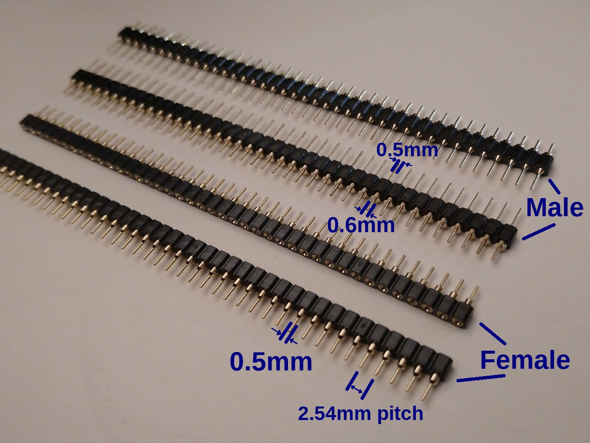

# Ignore this for the moment please need to fix it when I have the drive to. Sorry but thanks for looking. 

# 486SocketBlaster

486SocketBlaster is a simple voltage adapter for 486 processors. It allows you
to use a 3-volt 486 CPU on an older 5-volt-only motherboard. For example you
can use a DX4 or an Am5x86 on an old 486 motherboard that would normally only
work with 5-volt CPUs. This basically converts any 3-volt CPU to an "Overdrive".

# How does it work ?

It is really simple: All CPU pins are passed through to the motherboard socket,
except for the Vcc. Those are connected to the output of a mini buck converter
that can be soldered to the 486SocketBlaster board.

# Soldering/Assembly Instructions

This board is not the easiest thing to solder, but can be done with a standard
soldering iron and some patience.
The best way to solder the headers is to start with the innermost one and work
outwards in a spiral manner alternating between the top and bottom side as
needed (see image below). This way you only work on the outside and can easily
reach all the pins.

A desoldering gun may be useful when you accidentally clog up other holes. But
it is probably best to be very careful and avoid clogging them in the first
place. Also using flux makes it easier.

Please make sure you check the solder joints (also check for continuity) before
you add another row of headers on the same side, because the new row will
permanently block your access to the solder joints!
Desoldering a header is almost impossible even with a desoldering gun due to the
very tight hole tolerances.
So it has to be soldered correctly from the first try.

# Voltage regulator

The 486SocketBlaster can be powered by a cheap of-the-shelf buck converter, or
by an external one. The circuit board accepts two common types of small voltage
buck converters, usually found using keywords like "mini buck converter".
These are commonly rated at up to 3A of current. Given that 3-volt 486 CPUs are
usually very efficient (the DX4-100 is rated at max 3.55/5.22W typical/max) such
a regulator should be adequate in most cases.

If you are planning to overclock or to use a more power hungry CPU, please use
an external regulation circuit.

# WARNING!!!

Please make sure you know what you are doing!
Improper assembly/settings/use can damage both your precious motherboard and your precious CPU!

# Bonus Features

- External Power Header. This can be used either for monitoring the CPU voltage,
or for providing power externally, either with an external power supply or an
external voltage regulator.
- CPUMUL Header for selecting/overriding the CPU multiplier. This may be useful
for reducing the multiplier of a DX4 to 2x (66MHz) or Am5x86 to 3x (100MHz).

# Bill of materials

Item                            | ##  | Description
--------------------------------|-----|--------------------------------------------------------
mini buck converter             | 1   | We support two common sizes: 22x17mm and 18x12mm. These usually have chips like MP1584, MP2307 and others
40pin SIP pin header (male)     | 5   | Single-row round pin 2.54mm pitch (male). Socket pin diameter: 0.5mm, PCB pin diameter: 0.6mm. (see photo below)
40pin SIP socket header (female)| 5   | Single-row round pin sockets, 2.54mm pitch. PCB pin diameter: 0.5mm. (see photo below) 
SMD Capacitors                  | 4   | 10uF SMD 1206
Through-hole Capacitor          | 1   | 10uF ceramic through-hole capacitor
3-pin header 2.54mm pitch       | 1   | Header used for selecting the CPU Multiplier (CPUMUL)
Jumper 2.54mm pitch             | 1   | A jumper to for the CPUMUL header

Please note that the headers are a very tight fit. So please make sure that you get headers of the correct pin diameter.

With the limited testing I have done so far, it seems that you need at least
one 10uF through-hole ceramic capacitor, otherwise the voltage ripple is too
high and the system can become unstable with a DX4 @ 100MHz, using a cheap
MP1584-based buck converter.

